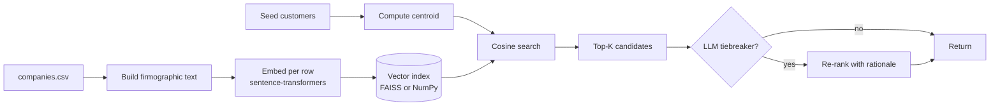

# icp-finder

Give it 5 happy customers. Get 100 lookalike companies, ranked.

This is the tool that should exist on every GTM engineer's resume because every founder has asked for it twice and nobody has shipped it cleanly. The approach: embed each company's firmographic + descriptive text once, store the vectors, then for any seed set compute the centroid and return the nearest unseen companies. An optional LLM tiebreaker re-ranks the top 200 candidates with explicit pros/cons against the seed set.

## The GTM problem this solves

Lookalike audiences are a solved problem in adtech and an unsolved problem in B2B. Vendors charge \$30k+ to wave a hand and produce a list. The actual algorithm is twenty lines once you have decent embeddings. This repo shows you can do it cleanly, explain the result, and ship it as both a CLI for analysts and an HTTP endpoint for downstream automation.

## Quick start

```bash
pip install -r requirements.txt
python -m icp.cli build-index --input data/companies.csv
python -m icp.cli find --seeds stripe.com,plaid.com,brex.com --top 25
```

Sample output:

```
rank  domain         score  why
1     ramp.com       0.94   Fintech, US, 1k–5k employees, similar B2B payments narrative
2     mercury.com    0.91   Fintech, US, 200–1k, banking-for-startups overlap
3     pilot.com      0.87   Fintech-adjacent, US, 200–1k, finance ops for startups
...
```

## How it works



## Design choices

**Local embeddings.** Default model is `sentence-transformers/all-MiniLM-L6-v2` because it's small, fast, and runs on CPU. Swap in OpenAI/Voyage embeddings via the `EMBED_PROVIDER` env var if you want better recall.

**FAISS optional.** For <50k companies a NumPy dot product is plenty. The repo defaults to NumPy and falls back to FAISS only if the dataset has more than `INDEX_FAISS_THRESHOLD` rows. One less moving part for evaluators.

**Centroid, not mean-of-pairs.** Computing the seed centroid and ranking by `cos(c_centroid, c_candidate)` is more stable than averaging pairwise similarities and has roughly equivalent recall on small seed sets.

**Tiebreaker is opt-in.** The pure-vector ranking is what you'd present in an enterprise sales meeting. The LLM re-rank exists for when an analyst wants explanations, not when a pipeline wants throughput.

## Layout

```
src/icp/
  embed.py          Local + remote embedding providers
  index.py          NumPy or FAISS index, persistent on disk
  search.py         Centroid + cosine + optional LLM re-rank
  api.py            FastAPI: POST /find
  cli.py            build-index, find, eval
data/
  companies.csv     Sample 200-row firmographic dataset
tests/
  test_search.py    Centroid math, ranking determinism
  test_index.py     Round-trip persistence
```

MIT.
